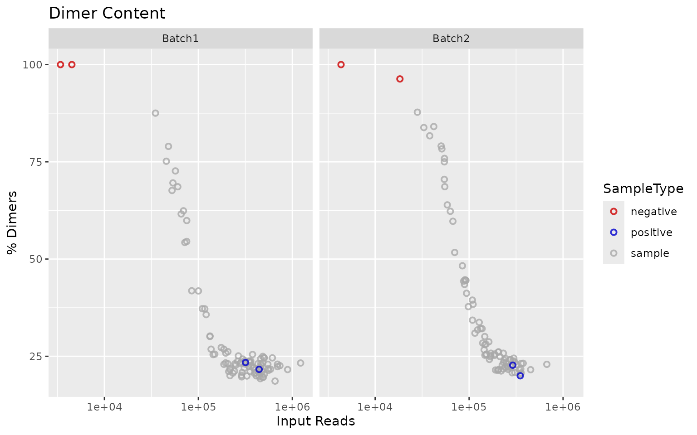
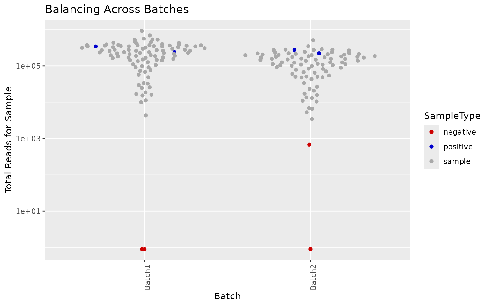
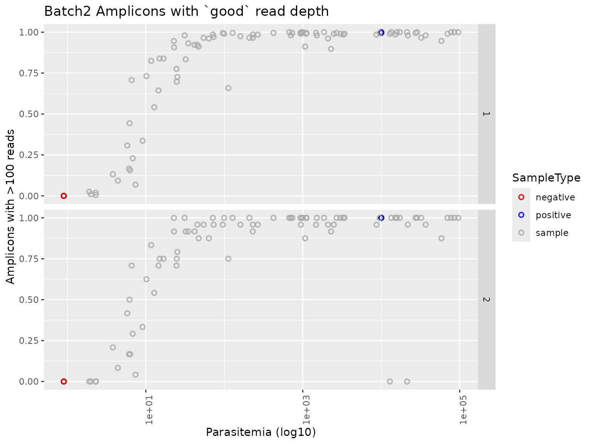
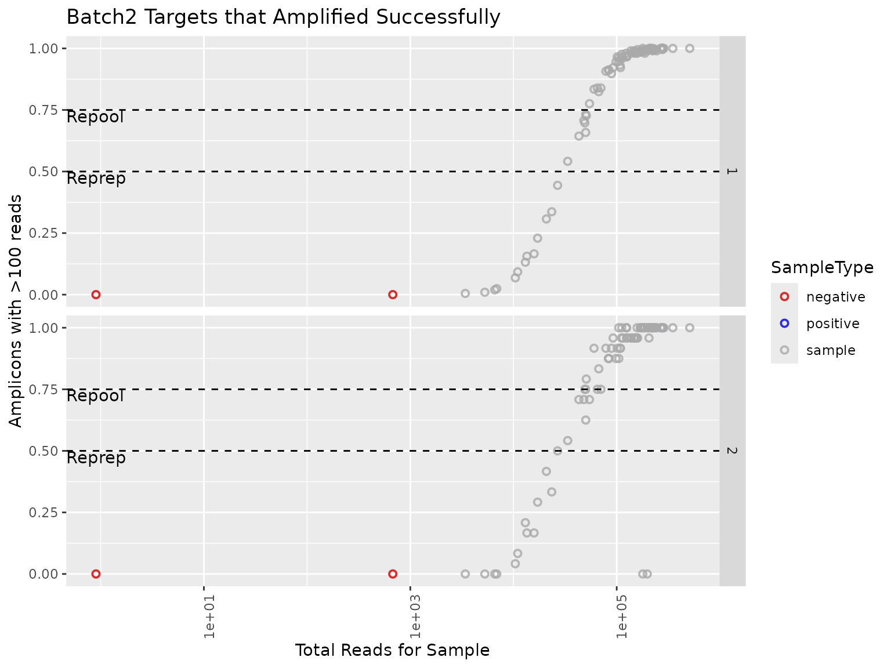
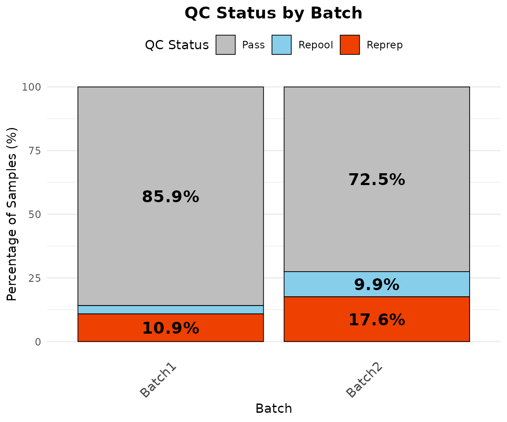
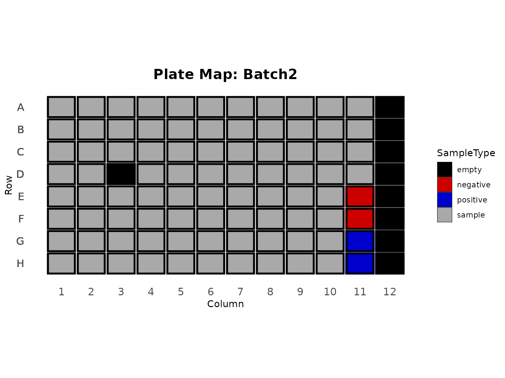
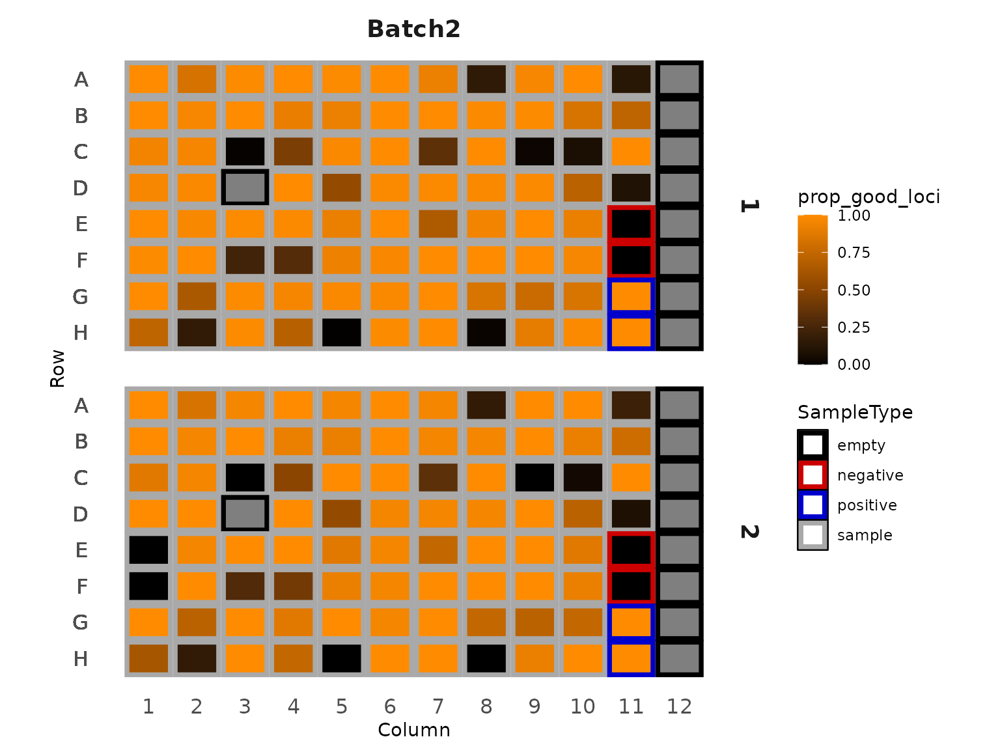
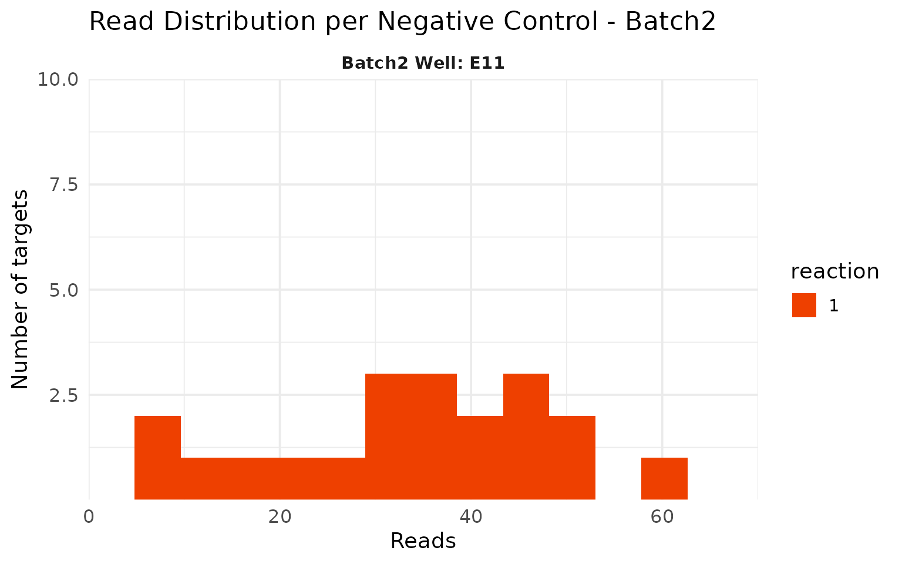
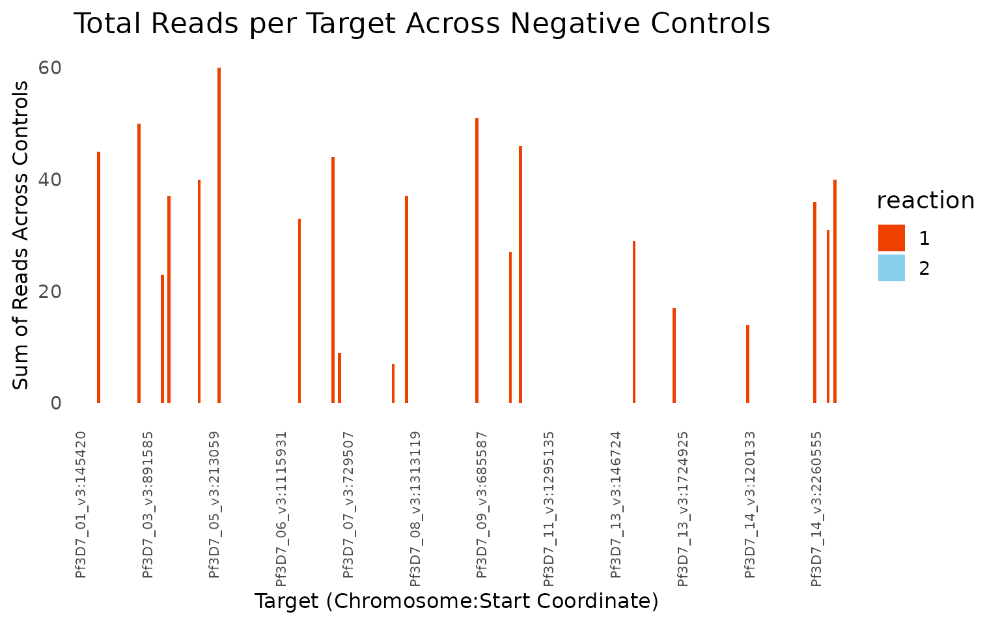

# Getting started: QC of a Mad4hatter run

This tutorial runs the QC on an example Mad4hatter run from start to
finish. The first section shows how to produce the full HTML report in
one step; the rest walks through each part of the QC with the package
functions, so you can see what the report is doing and reuse the steps
in your own analyses.

## The example run

The package includes a simulated run of the MAD4HatTeR panel, run with
Mad4hatter’s `--pools D1,R1,R2`. D1 and R1 were amplified in one mPCR
reaction and R2 in a second. The run has two batches, each on its own
96-well plate with 2 positive controls (3D7) and 2 negative controls.
Batch1 fills the plate with 92 samples; Batch2 has 84 samples and column
12 left empty. The data is simulated from the real MAD4HatTeR panel
information, so target names, pools and target lengths match a real run.

``` r

library(ampseqQC)
library(dplyr, warn.conflicts = FALSE)

tutorial_dir <- system.file("extdata", "tutorial", package = "ampseqQC")
results_dir <- file.path(tutorial_dir, "results")
manifest_file <- file.path(tutorial_dir, "manifest.csv")

list.files(results_dir, recursive = TRUE)
#> [1] "allele_data.txt"                     "amplicon_coverage.txt"              
#> [3] "panel_information/amplicon_info.tsv" "sample_coverage.txt"
```

The manifest describes each well:

``` r

manifest <- read_manifest(manifest_file)
head(manifest)
#>   sample_name SampleType  Batch Column Row Parasitemia
#> 1      B1_S01     sample Batch1      1   A      6788.9
#> 2      B1_S02     sample Batch1      1   B         1.3
#> 3      B1_S03     sample Batch1      1   C        11.1
#> 4      B1_S04     sample Batch1      1   D       453.2
#> 5      B1_S05     sample Batch1      1   E     16954.5
#> 6      B1_S06     sample Batch1      1   F     39949.5
count(manifest, Batch, SampleType)
#>    Batch SampleType  n
#> 1 Batch1   negative  2
#> 2 Batch1   positive  2
#> 3 Batch1     sample 92
#> 4 Batch2   negative  2
#> 5 Batch2   positive  2
#> 6 Batch2     sample 84
```

## Rendering the full report

[`render_qc_report()`](https://eppicenter.github.io/ampseq-qc/preview/pr-21/reference/render_qc_report.md)
runs every step below and writes an HTML report plus the QC output
tables to `output_dir`. It needs the [Quarto
CLI](https://quarto.org/docs/get-started/).

``` r

render_qc_report(
  results_dir = results_dir,
  manifest_file = manifest_file,
  output_dir = "qc_output"
)
```

**[View the report for this example
run](https://eppicenter.github.io/ampseq-qc/preview/pr-21/example-report/QC_report.md)**.

The output directory contains:

| File | Contents |
|----|----|
| `QC_report.html` | The QC report |
| `reprep_repool_summary.csv` | Pass/repool/reprep call for every sample and reaction |
| `samples_to_repool.csv`, `samples_to_reprep.csv` | Samples needing repool or reprep |
| `positive_control_polyclonal_info.csv` | Alleles at multiallelic targets in positive controls |
| `negative_control_amplified_targets.csv` | Negative control targets above the read threshold |
| `missing_samples_report.csv` | Samples in the manifest with no allele data |
| `missing_targets_report.csv` | Panel targets with no allele data |
| `allele_data_filtered.txt` | Allele table filtered by reads and within-sample allele frequency |

The collapsed allele table and the resistance marker tables are also
filtered when they are in the results directory.

## Step by step

### Loading the results

[`read_mad4hatter_results()`](https://eppicenter.github.io/ampseq-qc/preview/pr-21/reference/read_mad4hatter_results.md)
reads the pipeline outputs and trims the sequencing information from
sample names (for example `B1_S01_S1_L001` becomes `B1_S01`) so they
match the manifest.

``` r

results <- read_mad4hatter_results(results_dir)
names(results)
#> [1] "sample_coverage"                "amplicon_coverage"             
#> [3] "allele_data"                    "panel_information"             
#> [5] "collapsed_allele_data"          "resmarker_table"               
#> [7] "resmarker_microhaplotype_table"
head(results$amplicon_coverage)
#>   sample_name                 target_name reads OutputDada2
#> 1      B1_S01  PKNH_12_v2-0198893-0199083     3           0
#> 2      B1_S01 Pf3D7_01_v3-0145420-0145630  3183        3035
#> 3      B1_S01 Pf3D7_01_v3-0162888-0163092   411         358
#> 4      B1_S01 Pf3D7_01_v3-0181544-0181729  1350        1175
#> 5      B1_S01 Pf3D7_01_v3-0194763-0194942   730         679
#> 6      B1_S01 Pf3D7_01_v3-0455826-0456021  2651        2149
#>   OutputPostprocessing
#> 1                    0
#> 2                 3002
#> 3                  348
#> 4                 1151
#> 5                  674
#> 6                 2134
```

### Pools and reactions

The pools in the run are read from the panel information and mapped to
reactions using the panel settings. The defaults cover the MAD4HatTeR
and PfPHAST pools:

``` r

default_panel_settings()
#> <ampseqQC panel settings>
#> Pool -> reaction:
#>   1: D1, D1.1, 1A, R1, R1.1, R1.2, 1B, 5, M1, M1.1, M1.addon
#>   2: R2, R2.1, 2, M2, M2.1
#> Targets excluded from QC: 14
summarise_pools(results$panel_information)
#> # A tibble: 3 × 3
#>   pool  reaction n_targets
#>   <chr> <chr>        <int>
#> 1 D1    1              170
#> 2 R1    1               47
#> 3 R2    2               31
```

Targets shared by pools in different reactions are counted in each
reaction. In this run two targets are in both R1 and R2:

``` r

panel_reactions <- assign_reactions(results$panel_information)
panel_reactions |>
  count(target_name) |>
  filter(n > 1)
#>                   target_name n
#> 1 Pf3D7_13_v3-2841410-2841661 2
#> 2 Pf3D7_13_v3-2844354-2844599 2
```

If your run uses pools that aren’t in the settings, or a different
reaction layout, add them with
[`panel_settings()`](https://eppicenter.github.io/ampseq-qc/preview/pr-21/reference/panel_settings.md).
Pools without a reaction stop the QC rather than being guessed:

``` r

bespoke_panel <- results$panel_information |>
  mutate(pool = ifelse(pool == "R2", "myPool", pool))
assign_reactions(bespoke_panel)
#> Error:
#> ! No reaction is defined for pool(s): myPool.
#> Supply the reaction for each pool with panel_settings(), e.g. panel_settings(c("myPool" = "1"), base = default_panel_settings())

settings <- panel_settings(c(myPool = "2"), base = default_panel_settings())
assign_reactions(bespoke_panel, settings) |>
  count(reaction)
#>   reaction   n
#> 1        1 214
#> 2        2  31
```

### Targets excluded from QC

Species identification targets and long targets are left out of the QC
calculations, because they are not expected to amplify in every sample.
They are still kept in the filtered allele tables.

``` r

excluded <- qc_excluded_targets(results$panel_information, long_target_threshold = 275)
excluded$long
#> [1] "Pf3D7_02_v3-0320675-0320924" "Pf3D7_03_v3-0240989-0241224"
#> [3] "Pf3D7_05_v3-0615411-0615646" "Pf3D7_06_v3-0857486-0857720"
#> [5] "Pf3D7_11_v3-1294305-1294547" "Pf3D7_13_v3-1465035-1465280"
#> [7] "Pf3D7_13_v3-2840473-2840721" "Pf3D7_13_v3-2841410-2841661"
#> [9] "Pf3D7_13_v3-2844354-2844599"
intersect(excluded$excluded, results$panel_information$target_name)
#>  [1] "Pf3D7_13_v3-1041624-1041829"   "PmUG01_12_v1-1398020-1398213" 
#>  [3] "PocGH01_12_v1-1106482-1106671" "PvP01_12_v1-1185007-1185184"  
#>  [5] "PKNH_12_v2-0198893-0199083"    "Pf3D7_02_v3-0320675-0320924"  
#>  [7] "Pf3D7_03_v3-0240989-0241224"   "Pf3D7_05_v3-0615411-0615646"  
#>  [9] "Pf3D7_06_v3-0857486-0857720"   "Pf3D7_11_v3-1294305-1294547"  
#> [11] "Pf3D7_13_v3-1465035-1465280"   "Pf3D7_13_v3-2840473-2840721"  
#> [13] "Pf3D7_13_v3-2841410-2841661"   "Pf3D7_13_v3-2844354-2844599"

panel_reactions <- panel_reactions |>
  filter(!target_name %in% excluded$excluded)
amplicon_coverage_qc <- results$amplicon_coverage |>
  filter(!target_name %in% excluded$excluded)

nloci_table <- count_targets_per_reaction(panel_reactions)
nloci_table
#>   reaction nreactionloci
#> 1        1           205
#> 2        2            24
```

### Amplification success per sample

A target is successfully amplified if it has more than `read_threshold`
reads.
[`summarise_samples()`](https://eppicenter.github.io/ampseq-qc/preview/pr-21/reference/summarise_samples.md)
gives the proportion of targets amplified per sample and reaction.

``` r

amplicon_coverage_with_manifest <- merge_amplicon_coverage(amplicon_coverage_qc, manifest, panel_reactions)
summary_samples <- summarise_samples(amplicon_coverage_with_manifest, nloci_table, manifest, read_threshold = 100)

summary_samples |>
  select(sample_name, Batch, reaction, reads_per_reaction, n_good_loci, prop_good_loci) |>
  head()
#> # A tibble: 6 × 6
#>   sample_name Batch  reaction reads_per_reaction n_good_loci prop_good_loci
#>   <chr>       <chr>  <chr>                 <int>       <int>          <dbl>
#> 1 B1_NEG1     Batch1 1                         0           0              0
#> 2 B1_NEG1     Batch1 2                         0           0              0
#> 3 B1_NEG2     Batch1 1                         0           0              0
#> 4 B1_NEG2     Batch1 2                         0           0              0
#> 5 B1_POS1     Batch1 1                    305733         205              1
#> 6 B1_POS1     Batch1 2                     37249          24              1
```

Primer dimers make up most of the reads in low-density samples and in
negative controls:

``` r

sample_coverage_with_manifest <- merge_sample_coverage(results$sample_coverage, manifest)
generate_dimer_plot(sample_coverage_with_manifest)
```



Batch2 was sequenced less deeply than Batch1:

``` r

generate_balancing_plot(summary_samples)
```



Amplification success increases with parasitemia and read depth. The
dashed lines show the reprep and repool thresholds.

``` r

generate_parasitemia_by_amplification_success_plots(summary_samples, threshold = 100)$Batch2
```



``` r

generate_reads_by_amplification_success_plots(summary_samples, read_threshold = 100)$Batch2
#> Warning in ggplot2::scale_x_log10(): log-10 transformation introduced infinite values.
#> log-10 transformation introduced infinite values.
```



### QC calls

Samples are classified per reaction: below `reprep_threshold` of targets
amplified they need re-prep, below `repool_threshold` they need re-pool.
Samples in the manifest with no data are marked for reprep. Negative
controls are not classified.

``` r

qc_calls <- generate_reprep_repool_table(summary_samples, reprep_threshold = 0.5, repool_threshold = 0.75) |>
  fill_missing_data(manifest)

qc_calls |>
  filter(status != "pass") |>
  arrange(Batch, sample_name, reaction)
#> # A tibble: 68 × 8
#>    sample_name Batch  SampleType reaction status reason       reads_per_reaction
#>    <chr>       <chr>  <chr>      <chr>    <chr>  <chr>                     <dbl>
#>  1 B1_S02      Batch1 sample     1        reprep < reprep th…              13661
#>  2 B1_S02      Batch1 sample     2        reprep < reprep th…               1692
#>  3 B1_S03      Batch1 sample     1        repool < repool th…              30071
#>  4 B1_S03      Batch1 sample     2        repool < repool th…               3535
#>  5 B1_S12      Batch1 sample     1        reprep < reprep th…              16866
#>  6 B1_S12      Batch1 sample     2        reprep < reprep th…               1871
#>  7 B1_S20      Batch1 sample     1        reprep < reprep th…              15019
#>  8 B1_S20      Batch1 sample     2        reprep < reprep th…               1751
#>  9 B1_S24      Batch1 sample     1        reprep < reprep th…               9005
#> 10 B1_S24      Batch1 sample     2        reprep < reprep th…                947
#> # ℹ 58 more rows
#> # ℹ 1 more variable: prop_good_loci <dbl>
```

A few things stand out. Low-parasitemia samples fail in both reactions.
B2_S05 and B2_S06 amplified well in reaction 1 but not in reaction 2,
which points to a problem with the reaction 2 mPCR for those wells
rather than with the samples. B2_S20 is in the manifest but has no data,
because it was not sequenced.

The overall pass rate by batch excludes controls:

``` r

qc_summary_table(qc_calls)
#> # A tibble: 2 × 6
#>   Batch   pass repool reprep total pass_rate
#>   <chr>  <int>  <int>  <int> <int>     <dbl>
#> 1 Batch1    79      3     10    92      85.9
#> 2 Batch2    66      9     16    91      72.5
qc_summary_by_batch(qc_calls) |>
  plot_qc_status_by_batch()
```



Plate maps show where samples and controls are on each plate, and help
spot problems with particular wells or regions of the plate. Empty
wells, such as column 12 of the Batch2 plate, are shown in black:

``` r

quadrants <- create_plate_template(summary_samples, unique(summary_samples$Batch))
plot_plate_layouts(quadrants)$Batch2
```



``` r


plot_plate_heat_maps(
  summary_samples, quadrants,
  fill_param = "prop_good_loci", scale_midpoint = 0.5, scale_label = "prop_good_loci"
)$Batch2
```



### Positive controls

The positive controls are monoclonal 3D7, so each target should have a
single allele. A small number of targets with a low-frequency second
allele (here PCR errors at 2 to 4% frequency) is expected; many would
suggest contamination.

``` r

allele_data_qc <- results$allele_data |>
  filter(!target_name %in% excluded$excluded) |>
  add_allele_frequency()

positive_controls <- summarise_positive_controls(allele_data_qc, manifest, read_filter = 0, af_filter = 0.01)
positive_controls$category_counts
#> # A tibble: 8 × 3
#>   sample_name Category    Count
#>   <chr>       <chr>       <int>
#> 1 B1_POS1     2 Alleles       4
#> 2 B1_POS1     Monoallelic   225
#> 3 B1_POS2     2 Alleles       2
#> 4 B1_POS2     Monoallelic   227
#> 5 B2_POS1     2 Alleles       2
#> 6 B2_POS1     Monoallelic   227
#> 7 B2_POS2     2 Alleles       3
#> 8 B2_POS2     Monoallelic   226

positive_controls$polyclonal_information |>
  select(sample_name, target_name, reads, AlleleFreq)
#> # A tibble: 22 × 4
#>    sample_name target_name                 reads AlleleFreq
#>    <chr>       <chr>                       <int>      <dbl>
#>  1 B1_POS1     Pf3D7_05_v3-0668787-0668979   406     0.969 
#>  2 B1_POS1     Pf3D7_05_v3-0668787-0668979    13     0.0310
#>  3 B1_POS1     Pf3D7_07_v3-0405597-0405815   606     0.970 
#>  4 B1_POS1     Pf3D7_07_v3-0405597-0405815    19     0.0304
#>  5 B1_POS1     Pf3D7_14_v3-0421354-0421514  2945     0.961 
#>  6 B1_POS1     Pf3D7_14_v3-0421354-0421514   121     0.0395
#>  7 B1_POS1     Pf3D7_14_v3-1392869-1393059   968     0.972 
#>  8 B1_POS1     Pf3D7_14_v3-1392869-1393059    28     0.0281
#>  9 B1_POS2     Pf3D7_01_v3-0455826-0456021   621     0.979 
#> 10 B1_POS2     Pf3D7_01_v3-0455826-0456021    13     0.0205
#> # ℹ 12 more rows
```

Raising the allele frequency filter removes these low-frequency alleles:

``` r

summarise_positive_controls(allele_data_qc, manifest, af_filter = 0.05)$polyclonal_information
#> # A tibble: 0 × 7
#> # ℹ 7 variables: sample_name <chr>, target_name <chr>,
#> #   pseudocigar_masked <chr>, reads <int>, AlleleFreq <dbl>,
#> #   NumASVs_Meeting_Threshold <int>, Category <chr>
```

### Negative controls

Negative controls should have few or no reads. B2_NEG1 has low-level
reads at several D1 targets:

``` r

amplicons_negative <- negative_control_amplicons(amplicon_coverage_with_manifest)
negative_control_targets_over_threshold(amplicons_negative, negative_control_read_threshold = 50)
#>   sample_name                 target_name OutputPostprocessing
#> 1     B2_NEG1 Pf3D7_05_v3-0395919-0396103                   60
#> 2     B2_NEG1 Pf3D7_09_v3-0685587-0685792                   51

plot_negative_control_histogram(amplicons_negative |> filter(Batch == "Batch2"), batch_name = "Batch2")
```



Summing reads per target across negative controls shows which targets
are affected. In the report this plot is interactive.

``` r

summarise_negative_control_targets(amplicons_negative, results$panel_information) |>
  plot_negative_control_target_reads()
```



### Output tables

The allele tables written by the report keep all targets, including
those excluded from QC, and are filtered by reads and within-sample
allele frequency:

``` r

allele_data_filtered <- filter_allele_table(
  results$allele_data,
  group_cols = allele_table_group_cols()$allele_data,
  read_filter = 0,
  af_filter = 0.01
)
nrow(results$allele_data)
#> [1] 56236
nrow(allele_data_filtered)
#> [1] 56234

missing_samples_report(results$allele_data, manifest)
#>   sample_name  Batch SampleType Row Column Parasitemia
#> 1      B2_S20 Batch2     sample   D      3        14.9
```

## Using your own data

Point
[`render_qc_report()`](https://eppicenter.github.io/ampseq-qc/preview/pr-21/reference/render_qc_report.md)
at your Mad4hatter results directory and manifest. The manifest needs
the columns `sample_name`, `SampleType` (`sample`, `positive` or
`negative`), `Batch`, `Column`, `Row` and `Parasitemia`. Thresholds can
be changed with the arguments of
[`render_qc_report()`](https://eppicenter.github.io/ampseq-qc/preview/pr-21/reference/render_qc_report.md),
and pools outside MAD4HatTeR and PfPHAST need a `panel`:

``` r

render_qc_report(
  results_dir = "path/to/results",
  manifest_file = "path/to/manifest.csv",
  output_dir = "qc_output",
  panel = panel_settings(c(AMPLseq = "1"), base = default_panel_settings()),
  read_threshold = 50
)
```
